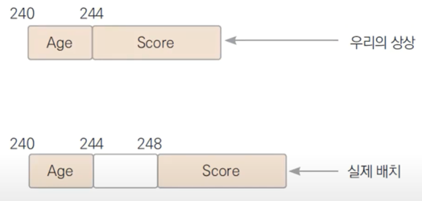
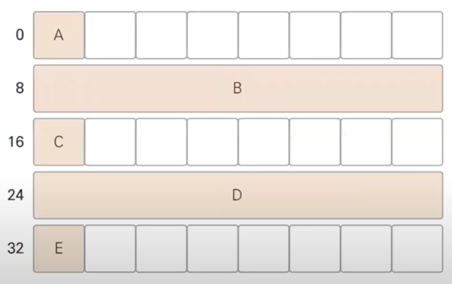
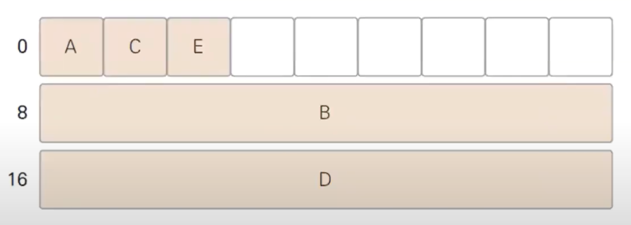

## 메모리 정렬

레지스터란, 실제 연산에 사용되는 데이터가 저장되는 곳이다.
이 레지스터 크기가 4바이트면 32비트 컴퓨터라 하고, 8바이트면 64비트 컴퓨터라 부른다.
레지스터 크기가 8바이트라는 이야기는 한 번의 연산에 8바이트의 크기를 연산할 수 있다는 의미이다.
따라서 데이터가 레지스터의 크기와 같은 크기로 정렬되어 있으면 컴퓨터 입장에서 더욱 효율적이다.

예를 들어, 64비트 컴퓨터에서 변수의 시작 주소를 8의 배수로 맞추지 않으면 성능적으로 손해보기 때문에,
프로그램 언어에서 데이터를 생성할 때 8의 배수인 메모리 주소에 데이터를 할당한다.

13-6 예제의 구조체를 다시 살펴보면,
```go
type User struct {
	Age int32
	Score float64
}

var user User
```

Age는 4바이트이고 Score는 8바이트다. 만약 user의 시작 주소가 240번이라면, 
첫번쨰 필드인 Age의 시작 주소도 240번이 된다. 바로 뒤에 붙여서 Score를 할당하면 
Score의 시작 주소는 244번이 된다. 244는 8의 배수가 아니므로 성능 손해가 발생하기 때문에
프로그램 언어에서 User 구조체를 할당할 때 Age와 Score 사이를 4바이트 만큼 띄워서 할당한다.
(아래 그림처럼)



이렇게 메모리 정렬을 위해 필드 사이에 공간을 띄우는 것을 메모리 패딩(Memory Padding)이라고 한다.

예제 13-7처럼 필드를 구성하면 
```go
type User struct {
    A int8 // 1
    B int  // 8
    C int8 // 1
    D int  // 8
    E int8 // 1
}
```

필드의 총합은 19바이트임에도
1바이트인 변수들 모두에 7바이트씩 패딩이 붙어 실제 구조체의 크기는
총 40바이트가 된다.
(아래 그림처럼 메모리가 할당됨)


예제 13-8처럼 8바이트보다 작은 필드를 8바이트 단위로 몰아서 배치하면
```go
type User struct {
    A int8 // 1
    C int8 // 1
    E int8 // 1
    D int  // 8
    B int  // 8
}
```
순서만 바꿔줬는데 구조체 크기가 24바이트가 되어 메모리를 절약할 수 있게 됐다!



### 패딩을 무조건 고려해야 하는가?
용량이 충분한 데스크탑 컴퓨터 어플리케이션이라면
패딩으로 인한 메모리 낭비를 크게 걱정하지 않아도 되지만,
메모리가 매우 작은 임베디드 하드웨어의 프로그램이라면
패딩을 고려하는 것이 좋다.